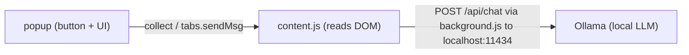

# Doxa — Development

Everything needed to build, sign, and ship Doxa. **End-user instructions live in
[README.md](README.md)** — this file is for working on the project.

- [Get the code](#get-the-code)
- [Repository layout](#repository-layout)
- [How it works](#how-it-works)
- [Firefox: run and sign](#firefox-run-and-sign)
- [Safari: convert, run, distribute](#safari-convert-run-distribute)
- [Syncing the Safari resources](#syncing-the-safari-resources)
- [Checks before committing](#checks-before-committing)
- [Release process](#release-process)
- [Xcode Cloud](#xcode-cloud)
- [Gotchas learned the hard way](#gotchas-learned-the-hard-way)

## Get the code

```bash
git clone https://github.com/nschoch/doxa.git
cd doxa
```

Or download the repo zip (green **Code** button → **Download ZIP**). If you only
want to *install* Doxa, use the signed `.xpi` from the latest
[Release](https://github.com/nschoch/doxa/releases) instead of the source.

The folder you care about is **`extension/`** — the raw WebExtension that Firefox
loads directly and that gets converted for Safari. `Comment Summarizer/` is the
generated Xcode project, `derivedData/` is CLI build output, and `tools/` holds
the test/diagnostic scripts.

## Repository layout

```
extension/                 # the WebExtension (single source of truth)
  manifest.json            # MV3 manifest (Firefox/Safari)
  background.js            # provider calls (Ollama / OpenAI-compatible) + timeout
  content.js               # extractors, on-page card, follow-up, orchestration
  popup.html/css           # toolbar popup (trigger + settings)
  popup.js                 # triggers the content script, saves settings
  icons/                   # toolbar icons

Comment Summarizer/        # generated Safari container app + extension (Xcode)
  Doxa Comment Summarizer.xcodeproj   # project + targets are "Doxa ..."
  Comment Summarizer/           # container app sources
  Comment Summarizer Extension/ # Safari extension sources
    Resources/                  # ← COPIES of extension/ files (see syncing)

tools/                     # node test + diagnostic scripts
PRIVACY.md                 # published at nickschoch.com/doxa/PRIVACY.html
```

## How it works



The content script owns orchestration: it collects comments, injects the on-page
summary card (which survives popup close / tab switch), asks the background to
call the provider, and renders the result. Requests are delivered over a
**long-lived port** (`browser.runtime.connect({name:"summarize"})`) — that's what
lets the background reply after the popup has closed.

## Firefox: run and sign

### Temporary install (development)

1. Open `about:debugging#/runtime/this-firefox`.
2. **Load Temporary Add-on**.
3. Select `extension/manifest.json` (Firefox loads the whole folder).
4. Visit a Reddit thread or YouTube video and click the toolbar icon.

Loads until Firefox restarts — no account or signing required. Firefox
**Developer Edition / Nightly** can also install unsigned add-ons permanently by
setting `xpinstall.signatures.required = false` in `about:config`.

### Signing a permanent `.xpi` (maintainer)

Signing goes through [addons.mozilla.org (AMO)](https://addons.mozilla.org/developers/).

Manifest requirements, already present in this repo:

- `browser_specific_settings.gecko.id` — permanent add-on id
  (`comment-summarizer@local`).
- `browser_specific_settings.gecko.data_collection_permissions` — a
  `{ "required": [...] }` array declaring the data collected/transmitted. This
  build declares `["websiteContent"]`. **AMO rejects new add-ons without it.**
- `browser_specific_settings.gecko.strict_min_version` — **142.0**, because
  `data_collection_permissions` is only honored from Firefox 140+ (142 on Android).

To produce a signed `.xpi`:

1. Create AMO **API credentials** (issuer + secret) at
   <https://addons.mozilla.org/developers/addon/api/key/>, stored in the
   gitignored `doxa-amo.env`.
2. Zip the **contents** of `extension/` so `manifest.json` sits at the zip root:
   ```bash
   cd extension && zip -r ../doxa-extension-<version>.zip . -x '.*'
   ```
3. Upload that zip to AMO (**Submit a New Add-on** → **"On your own"**), or sign
   from the CLI:
   ```bash
   npm i -g web-ext
   web-ext sign --source-dir extension --channel unlisted \
     --api-key <issuer> --api-secret <secret>
   ```

Both produce a signed `.xpi` (e.g. `doxa-<version>-fx.xpi`) — attach it to the
GitHub Release. Because it's self-hosted, Firefox won't auto-update it, so the
extension's own "Update available" banner points users at each new release.

> **AMO hiccup to remember:** `web-ext sign` can fail at its download step
> ("fetch failed") *after* AMO accepted the upload; re-running for the same
> version then returns **400 "This upload has already been submitted."** Pull the
> signed file from the API instead with a JWT (issuer/secret from `doxa-amo.env`):
> `GET /api/v5/addons/addon/comment-summarizer@local/versions/<version>/` (note the
> `/addon/` segment) and download `file.url` with the same `Authorization: JWT <token>`.

## Safari: convert, run, distribute

Safari can't load an extension folder: the extension must live inside a macOS
**container app**. The Xcode project in `Comment Summarizer/` is generated (and
committed, so Xcode Cloud can build it).

### Regenerating the project

**Xcode is required.** Run this from the repo root, as **one line**, without
`--project-name`:

```bash
xcrun safari-web-extension-converter --app-name "Doxa Comment Summarizer" --bundle-identifier com.theschochs.doxa --macos-only --force extension/
```

> - **Don't pass `--project-name`** — it isn't a supported flag (the tool wraps
>   Apple's `safari-web-extension-packager`). Passing it prints **"Please provide
>   a path to a web extension to convert."** and aborts even when `extension/` is
>   right there. `\` line-continuations break it the same way — paste as one line.
> - **If `xcrun` says "unable to find utility":** `xcode-select` points at the
>   Command Line Tools. Fix with
>   `sudo xcode-select -s /Applications/Xcode.app/Contents/Developer`, or call
>   `/Applications/Xcode.app/Contents/Developer/usr/bin/safari-web-extension-packager`
>   with the same flags. Both produce the same project.
> - **Converter warns about manifest keys:** it reports keys Safari doesn't fully
>   support (`background.scripts` in MV3 is the usual one). Recent Safari handles
>   it; read the packager output if the background script doesn't run.

### Running locally

1. Open `Comment Summarizer/Doxa Comment Summarizer.xcodeproj`.
2. Select the **Comment Summarizer** target → **Signing & Capabilities** → set
   your **Team** (a free personal Apple ID team runs on your own Mac).
3. Pick **My Mac** and press **Run** (⌘R) — this builds and launches the container
   app and registers the extension with Safari.
4. Safari → **Settings → Extensions** → enable **Doxa**, then approve access for
   `reddit.com` / `youtube.com`.
   - If it isn't listed, enable Safari's **Develop** menu (Settings → Advanced →
     "Show features for web developers"), then **Develop → Allow Unsigned
     Extensions**, and re-check. Unsigned dev builds can be disabled again after
     Safari quits/relaunches — re-enable and toggle it back on.

### Distributing

The container app must be signed with a **paid** Apple Developer Program account
(a free personal team only runs on your own Mac). This project ships both routes,
direct download first:

- **Direct download (no review):** sign with a **Developer ID Application**
  certificate, then **Product → Archive → Distribute App → Direct Distribution** —
  Xcode signs, notarizes, and staples. Wrap the exported app in a DMG, staple the
  DMG, attach it to a GitHub Release.
- **Mac App Store:** archive with an **Apple Distribution** certificate
  (Archive → Distribute App → App Store Connect), beta via TestFlight, then submit
  for review.
  > **Choose "TestFlight & App Store" when uploading from Xcode**, not "TestFlight
  > Internal Testing Only". The latter uploads the build with audience
  > `INTERNAL_ONLY`, which is testable but **cannot be attached to an App Store
  > version** — the API rejects it with 409 "The specified pre-release build could
  > not be added". Xcode Cloud's Archive action produces `APP_STORE_ELIGIBLE`
  > builds. Check with `GET /v1/builds?filter[app]=…` →
  > `attributes.buildAudienceType`.

**Notarization (CLI alternative).** `notarytool` needs no keychain, so it works
even where CLI *signing* is broken (see below). It requires an app that is
**already Developer ID-signed** — get one via Organizer → **Export** → Developer
ID, then:

```bash
xcrun notarytool submit "Doxa.app" \
  --key AuthKey_<KEYID>.p8 \
  --key-id <KEYID> \
  --issuer <ISSUER_UUID> \
  --wait
xcrun stapler staple "Doxa.app"
```

Staple the **app** before packaging the DMG.

### Identifiers and settings

- Bundle IDs: `com.theschochs.doxa` (container app) and
  `com.theschochs.doxa.Extension` (extension target).
- Display name is **Doxa** for both targets
  (`INFOPLIST_KEY_CFBundleDisplayName`), and `PRODUCT_NAME` is **Doxa** (app) /
  **Doxa Extension** (extension) — so macOS, Finder and Safari's Extensions pane
  all show "Doxa" and the app builds as **`Doxa.app`**.
- The **project and targets** are named "Doxa Comment Summarizer" /
  "Doxa Comment Summarizer Extension" (project at
  `Comment Summarizer/Doxa Comment Summarizer.xcodeproj`). The source folders
  `Comment Summarizer/` and `Comment Summarizer Extension/` kept their old names.
  The **shared scheme is still named "Comment Summarizer"** — leave it that way:
  the Xcode Cloud workflow references it by that name, so renaming the scheme
  means updating the workflow as well. Rebuild (⌘R) after changing a name; Safari
  picks it up on next launch.
- Team `LJVYV7ZJ44`; signing style **Automatic** (the pinned
  `CODE_SIGN_IDENTITY = "Apple Development"` was removed so archive/distribution
  selects the correct identity — don't reintroduce it).
- Deployment target: container app **macOS 13.0**; extension target 10.14.
- `ENABLE_APP_SANDBOX` and `ENABLE_HARDENED_RUNTIME` are on for both targets.
- **Don't change the bundle ID after the first public release** — it's locked to
  the App Store record and to installed copies.

### Duplicate "Doxa" entries in Safari's Extensions list

Safari lists **every registered copy** of the extension. `Product → Archive`
builds into
`…/DerivedData/<project>/Build/Intermediates.noindex/ArchiveIntermediates/<target>/InstallationBuildProductsLocation/Applications/Doxa.app`
and macOS registers the extension from *that* staging path — so a second (later
third) "Doxa" shows up, and the registration can outlive the folder it points at
(which also breaks the extension Safari is actually using).

Diagnose and clean up:

```bash
# the registry Safari reads — expect exactly ONE Doxa entry
pluginkit -m -p com.apple.Safari.web-extension -v

pluginkit -r "<dead appex path>"              # unregister an orphaned copy
rm -rf ~/Library/Developer/Xcode/DerivedData/<project>-*   # kill the staging copy
lsregister -f /Applications/Doxa.app          # re-register the real app…
pluginkit -a "/Applications/Doxa.app/Contents/PlugIns/Doxa Extension.appex"
```

Then **quit and reopen Safari** and re-enable the extension (site permissions may
need re-approving). Notes: `lsregister -kill` no longer exists in current macOS,
`lsregister -u` does not clear the `InstallationBuildProductsLocation` record
(only a reboot/logout does), and removing a registration affects *all* Safari
extensions — re-register any (e.g. Obsidian) that goes missing.

**Prevention:** let **Xcode Cloud** build (it never touches this Mac), and delete
DerivedData after any local archive.

## Syncing the Safari resources

`Comment Summarizer Extension/Resources/` holds **copies** of the `extension/`
files. After editing anything under `extension/`, copy the changed files across
(manifest, `background.js`, `content.js`, `popup.*`) and rebuild in Xcode.
`extension/` remains the source of truth.

## Keyboard shortcuts

The manifest declares two `commands`. `background.js` listens for
`commands.onCommand` and relays to the active tab's content script (no popup is
open when a shortcut fires):

| Command id | Runs | Suggested key |
|---|---|---|
| `summarize` | `startSummary()` — the popup's main button | ⌥⇧S / ⌘⌥S |
| `summarize-with-gemini` | `geminiShortcut()` — mirrors the popup's Gemini hand-off | ⌥⇧G / ⌘⌥G |

- **Safari ignores `suggested_key`** — assign keys in Safari → Settings →
  Extensions → Doxa → Shortcuts (Chrome honours the suggested keys). Note Safari
  lists the extension's *toolbar item* there too; that row only opens the popup.
- Both commands reuse the popup's own entry points, so the enabled-site checks,
  the YouTube Data API key requirement and the on-page card behave identically.
- Feedback goes to the card (there's no popup), and the **clipboard write happens
  in the content script** because the background has no DOM. Gemini still needs a
  manual paste — its web app strips URL prompt parameters.

## Checks before committing

```bash
node --check extension/content.js extension/background.js extension/popup.js
npx web-ext lint --source-dir extension      # target: 0 errors / 0 warnings / 0 notices
node tools/test-reddit-cap.mjs
node tools/test-render-markdown.mjs
```

`tools/` also contains diagnostics that fetch live pages and report green/red
(e.g. `tools/diagnose-youtube.mjs`) — useful when an extractor breaks.

## Release process

1. Bump `version` in `extension/manifest.json` (and mirror the Resources copy).
2. Run the checks above.
3. Sign the Firefox build and zip the extension:
   ```bash
   cd extension && zip -r ../doxa-extension-<version>.zip . -x '.*'
   ```
4. Commit, tag `v<version>`, push the tag.
5. Publish a **GitHub Release** with the assets: `doxa-extension-<version>.zip`
   and the signed `doxa-<version>-fx.xpi`. Installed copies then show the
   "Update available" banner pointing at it.
6. For an App Store update: archive with Apple Distribution and upload through
   Xcode or Xcode Cloud, then submit the new version.

## Xcode Cloud

Xcode Cloud builds from the committed git repo, so the Xcode project **must stay
committed** (it was previously gitignored, which made the cloud build fail with
"Project … does not exist"). It archives for App Store/TestFlight and manages its
own signing credentials — the App Store Connect API key is *not* used by Xcode
Cloud, so never commit the `.p8`. The **shared scheme** is committed (xcshareddata/xcschemes/Comment Summarizer.xcscheme) for the same reason — Xcode Cloud needs a shared scheme, and an unshared one is invisible to it. The workflow also stores a
**`containerFilePath`** pointing at the `.xcodeproj` — **if you rename or move the
project, update the workflow**, or the next cloud run fails with "Project … does
not exist". It is writable through the App Store Connect API:
`PATCH /v1/ciWorkflows/{id}` with `{"data":{"type":"ciWorkflows","id":…,"attributes":{"containerFilePath":"…"}}}`.

Local CLI signing on this machine is broken (`errSecInternalComponent` — keychain
access is GUI-only), so signing/archiving happens in the Xcode GUI or in Xcode
Cloud, not via `xcodebuild`.

## Gotchas learned the hard way

- **Safari `window.open` from a content script is unreliable** — card source links
  are opened via the background (`api.tabs.create`) instead.
- **Content-script ↔ background messaging:** plain `sendResponse` and
  `tabs.sendMessage` round-trips were dropped, and the card stayed stuck at
  "Summarizing…". The long-lived **port** pattern is the fix; don't refactor it
  back to one-shot messages.
- **YouTube comments are not scrapeable** — they're behind a closed shadow DOM and
  lazy-loading, and the `timedtext` caption URL returns an empty body (origin-token
  gate). Hence the YouTube Data API path, fetched from the *background* so CORS is
  handled.
- **`launchctl setenv` does not survive a reboot** — re-apply `OLLAMA_ORIGINS`
  and restart Ollama, or add a launch agent/local proxy for permanence.
