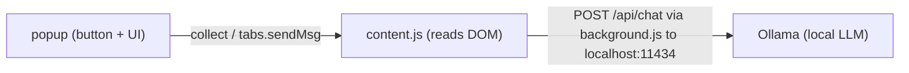

# Doxa

A cross-browser extension (Firefox + Safari) that summarizes **Reddit thread
comments** and **YouTube video comments** using a **local Ollama** LLM. Nothing
leaves your machine. Click the toolbar button on a Reddit thread or a YouTube
video and it reads the comments, summarizes them, and shows you a structured
TL;DR.



## Requirements

You need **one summarization provider** (pick it in the extension's Settings):

- **Ollama** (local, default) — served over HTTP, e.g. local
  `http://localhost:11434` (or another host on your LAN), with a model pulled
  (e.g. `qwen3.6:35b-a3b`). Nothing leaves your machine/LAN.
- **OpenAI-compatible** (OpenRouter or a custom server) — any server that speaks
  the OpenAI chat-completions API. **OpenRouter** is a built-in preset (an API
  key + a model id, e.g. `openai/gpt-4o-mini`; a free key is available at
  openrouter.ai, **no local server required**), or use a **custom** server (e.g.
  a local ninfer/LM Studio/vLLM endpoint) by setting the base URL.

Plus:

- **Firefox** (to load the extension directly) and/or **Xcode + Safari**
  (to convert and run on Safari).
- Optional: a **YouTube Data API key** to summarize YouTube comments
  (free from console.cloud.google.com → enable YouTube Data API v3).

## 0. Get the code

The project lives at **https://github.com/nschoch/doxa**. Grab it either way:

**Option A — clone with git (best if you'll develop/edit it):**

```bash
git clone https://github.com/nschoch/doxa.git
cd doxa
```

**Option B — download the zip (no git needed):** on the repo page click the green
**Code** button → **Download ZIP**, then unzip it. (If you only want to install,
use the `.xpi` attached to the latest [Releases](https://github.com/nschoch/doxa/releases)
page instead of the source.)

In both cases the folder you care about is **`extension/`** — that's the raw
WebExtension you load into Firefox (or convert for Safari). Everything else
(`Comment Summarizer/`, `derivedData/`, `*.xcodeproj`) is Safari/Xcode build
output you can ignore.

> To pick up updates later, `git pull` (Option A) or re-download a fresh zip
> (Option B), then reload.

## 1. Set up Ollama (local provider)

On the machine running Ollama, pull a model:

```bash
ollama pull qwen3.6:35b-a3b
```

By default Ollama only allows cross-origin requests from `localhost`. Because
the extension calls it over the network from its own origin, enable CORS.
Set the `OLLAMA_ORIGINS` environment variable before starting the server:

```bash
# allow any origin (simplest for local/LAN use)
OLLAMA_ORIGINS=* ollama serve
```

If you run Ollama as a background service, stop it and start it with the env
var (or add it to your launch config). Test it reaches the model:

```bash
curl http://localhost:11434/api/chat -d '{
  "model":"qwen3.6:35b-a3b",
  "messages":[{"role":"user","content":"Say hello"}],
  "stream":false
}'
```

## 2. Install in Firefox

Firefox loads either a **temporary** add-on (dev) or a **Mozilla-signed `.xpi`**
(permanent). Two routes:

### 2a. Temporary install — fastest, for development

1. Open Firefox and go to `about:debugging#/runtime/this-firefox`.
2. Click **Load Temporary Add-on**.
3. Select `extension/manifest.json` in this folder (Firefox loads the whole
   folder itself).
4. Navigate to a Reddit thread or a YouTube video and click the extension's
   toolbar icon (pin it from the puzzle-piece button if it isn't in the toolbar).

This loads until Firefox restarts — repeat the 3 clicks next session. No account
or signing required.

### 2b. Permanent / signed install — for regular use

Release Firefox only accepts **Mozilla-signed** add-ons, so to keep Doxa
installed you need a signed `.xpi`.

**Install (easiest):** download the already-signed **`.xpi`** from the latest
[Release](https://github.com/nschoch/doxa/releases) — it's named
`doxa-<version>-fx.xpi` — then `about:addons` → gear → **Install Add-on From
File** (or drag the file onto the `about:addons` page). No account or signing
needed.

**Building a new signed version (maintainer):** signing goes through
[addons.mozilla.org (AMO)](https://addons.mozilla.org/developers/).

Manifest requirements (already present in this repo):

- `browser_specific_settings.gecko.id` — a permanent add-on id
  (`comment-summarizer@local`).
- `browser_specific_settings.gecko.data_collection_permissions` — a
  `{ "required": [...] }` array declaring the data the add-on collects/transmits.
  This build declares `["websiteContent"]`. **AMO rejects new add-ons without
  it.**
- `browser_specific_settings.gecko.strict_min_version` — set to **142.0**, since
  `data_collection_permissions` is only honored from Firefox 140+ (142 on
  Android).

To produce a signed `.xpi`:

1. Create an AMO account and generate **API credentials** (issuer + secret) at
   https://addons.mozilla.org/developers/addon/api/key/.
2. Zip the **contents** of `extension/` so `manifest.json` sits at the zip root
   (not wrapped in an `extension/` folder):
   ```bash
   cd extension && zip -r ../doxa-extension-<version>.zip . -x '.*'
   ```
3. Either upload that zip to AMO (**Submit a New Add-on** → choose **"On your
   own"** → upload → download the signed `.xpi`), or sign from the CLI:
   ```bash
   npm i -g web-ext
   web-ext sign --source-dir extension --channel unlisted \
     --api-key <issuer> --api-secret <secret>
   ```
   Both produce a **signed `.xpi`** (e.g. `doxa-extension-<version>-an+fx.xpi`).

Because this is self-hosted ("on your own"), Firefox won't auto-update it; the
extension's own **"Update available"** banner points at each new GitHub Release
instead, so attach the fresh `.xpi` to every release.

> **Just testing?** Firefox **Developer Edition / Nightly** can install unsigned
> add-ons directly (set `xpinstall.signatures.required = false` in `about:config`),
> so you can load the zipped folder without signing.

## 3. Convert for Safari

Safari doesn't load extension folders directly: a Safari extension must live
inside a small macOS **container app**. You convert the same `extension/` folder
with Apple's command-line converter (bundled with Xcode). **You need Xcode** —
install it from the App Store, then in Terminal run:

> **Paste it as one line** and don't use `--project-name`. Run this inside the
> folder that contains `extension/`:

```bash
xcrun safari-web-extension-converter --app-name "Comment Summarizer" --bundle-identifier com.theschochs.doxa --macos-only --force extension/
```

> Gotchas:
> - **Don't pass `--project-name`** — it isn't a supported flag (the tool is a
>   thin wrapper around Apple's `safari-web-extension-packager`). Passing it
>   makes the converter print **"Please provide a path to a web extension to
>   convert."** and abort, even if `extension/` is right there.
> - Don't break the command across lines with `\` continuations; a mangled paste
>   produces the same "no path" error.
> - First confirm `extension/manifest.json` exists (`ls extension`).
> - The project is generated into a `Comment Summarizer/` folder beside the
>   source as `Comment Summarizer/Comment Summarizer.xcodeproj`.

> **If `xcrun` says "unable to find utility":** your `xcode-select` is pointed at
> the Command Line Tools, not Xcode. Either fix it (`sudo xcode-select -s
> /Applications/Xcode.app/Contents/Developer`), or call the converter directly by
> its full path:
> `/Applications/Xcode.app/Contents/Developer/usr/bin/safari-web-extension-packager`
> with the same flags. (Both produce the same project.)

That generates an Xcode project. Then:

1. Open the generated `.xcodeproj` in Xcode.
2. Select the **Comment Summarizer** target → **Signing & Capabilities** → set
   your **Team** (a free personal Apple ID team works to run on your own Mac).
   If you don't have a team, create one in Xcode → Settings → Accounts.
3. Pick a device (e.g. **My Mac**) and press **Run** (⌘R). This builds and
   launches the container app and registers the extension with Safari.
4. Enable the extension:
   - Safari → **Settings → Extensions** → toggle **Comment Summarizer** **on**.
   - If it isn't listed, first enable Safari's **Develop** menu
     (Safari → Settings → Advanced → check **"Show features for web developers"**),
     then **Develop → Allow Unsigned Extensions**, and re-check Settings.
   - When prompted, grant it permission to run on `reddit.com` / `youtube.com`.
5. To make changes later, re-run the converter with `--force`, or edit the files
   inside the Xcode project's `Resources` folder and rebuild.

> **What to do if the converter warns about manifest keys:** it reports keys
> Safari doesn't fully support. `background.scripts` in MV3 is the usual one —
> leave it (recent Safari handles it), or if Safari shows no background running,
> convert the folder (optionally) and let the packager pick the compatible
> shape. The packager logs the specifics, so read its output.

> **Unsigned extensions need re-enabling:** after Safari quits/relaunches, it
> can disable an unsigned extension. Re-check **Develop → Allow Unsigned
> Extensions**, then toggle it on again in Settings.

### Distribute (other people's Macs)

To actually *distribute* it, the container app must be signed with a **paid**
Apple Developer Program account (a free personal team only runs on your own
Mac). Two routes — this project ships both, direct download first:

- **Direct download (fastest, no review):** sign the container app with a
  **Developer ID Application** certificate, then **Product → Archive → Distribute
  App → Direct Distribution** in Xcode — this signs, notarizes, and staples
  automatically. Wrap the exported app in a DMG and attach it to a GitHub
  Release. Users download, open the app once, then enable it under
  Safari → Settings → Extensions. No "Allow Unsigned Extensions" toggle needed
  for a notarized build.
- **Mac App Store (auto-updates + widest reach):** register the same bundle ID in
  App Store Connect, sign with an **Apple Distribution** certificate
  (Archive → Distribute App → App Store Connect), distribute a beta via
  TestFlight, then submit for review.

The Xcode project uses bundle id `com.theschochs.doxa` (+ `.Extension` for the
extension target) and targets macOS 13+. **Don't change the bundle id after the
first public release** — it's locked to the App Store record and installed
copies. For personal single-Mac use, the unsigned develop-and-run flow above is
enough.

## Usage

1. Open a Reddit thread or a YouTube video.
2. Click the **Doxa** toolbar button:
   - **Summarize comments** — summarizes the thread's comments. On **YouTube**
     this uses the **YouTube Data API** (if you've added a key) to reliably
     fetch the comments; otherwise it falls back to auto-scroll DOM scraping.
   - **Summarize with Gemini (open in tab)** — (on a YouTube video) opens a
     fresh `gemini.google.com` chat and **copies the prompt** ("Summarize this
     video: <url>") to your clipboard. Paste it (⌘V) and press Send. (Gemini
     strips URL prompt params, so we can't auto-fill.) This needs **no YouTube
     Data API key** — it shows on any enabled YouTube video.
3. The summary appears as an **on-page card** (bottom-right), so it keeps running
   even if you switch tabs or close the popup. Use **Copy** on the card.
4. **Ask a follow-up** — after a summary, type a question in the card's
   "Ask a follow-up…" field. The answer is grounded in the same source
   (the comments) and rendered below the summary.

> **Repeat clicks reuse the last result.** If you summarize the same page again
> (without refreshing), the card shows the cached summary instead of re-running
> the model. Use the card's **Regenerate** button (or reload the page) to force a
> fresh summary.

### Update checking

The extension can't install updates by itself (it isn't distributed through a
store with auto-update — Safari builds come from Xcode, Firefox from a
file/temp load). Instead, each time you open the popup it quietly checks GitHub
for the newest published **Release** of this project and, if a newer version
exists, shows an **"Update available"** banner with a **View release** button
that opens the release page in a new tab (the footer also shows your installed
version and a **Check for updates** link to force a re-check). Dismiss it with
**×** and it won't nag about that same version again.

> **If it's listed on AMO:** Firefox auto-updates the add-on from
> addons.mozilla.org, so this in-extension banner isn't needed for listed builds —
> it only matters for self-hosted `.xpi` installs.

For this to work, each new version must be published as a GitHub Release with a
version tag (e.g. `v1.0.0`); pre-releases and drafts are ignored. Checks are
rate-limited to at most one GitHub API call every 6 hours per machine.

### Settings (in the popup)

- **Provider** — `Ollama (local)` or `OpenAI-compatible`. When you pick
  OpenAI-compatible, choose a **Preset**: **Custom** (any OpenAI-compatible
  server) or **OpenRouter**.
- **Ollama URL** — defaults to `http://localhost:11434` (run the server with
  `OLLAMA_ORIGINS=*` so the extension's browser requests are allowed).
- **Ollama model** — your pulled local model, e.g. `qwen3.6:35b-a3b`.
- **Base URL** — the OpenAI-compatible endpoint. For the **OpenRouter** preset
  this is locked to `https://openrouter.ai/api/v1`; for **Custom** set your
  server, e.g. `http://localhost:8000/v1` (ninfer/LM Studio/vLLM).
- **Model** — the model id for the OpenAI-compatible provider, e.g.
  `openai/gpt-4o-mini` (OpenRouter) or your local model.
- **LLM API key** — required for OpenRouter, optional for a custom local server.
  Distinct from the YouTube Data API key; it's the key for the summarization
  model.
- **Sites** — checkboxes to enable **Reddit** and **YouTube**, plus a **YouTube
  Data API key** field right under the YouTube toggle. The extension only acts on
  enabled sites (this stops Safari asking to access every website). On YouTube,
  **Summarize comments** needs a Data API key, but **Summarize with Gemini** does
  not — the Gemini button appears on any enabled YouTube video even before you add
  a key.
- **Fetch available models** — queries the active provider
  (Ollama `/api/tags`, or the OpenAI-compatible `/models` endpoint) and lets you
  pick a model to fill the model field.
- **Timeout (seconds)** — how long to wait before failing. Bump to 300–600 if a
  large local model is slow. Default 180.
- **Max comments** — cap on comments sent (keeps requests fast).
- **Max comments per thread (Reddit)** — how many comments each top-level Reddit
  thread contributes (default 30), so one huge off-topic thread can't crowd out
  the rest of the discussion. Raise it to sample deeper threads; set it near
  **Max comments** to effectively disable the per-thread cap.
- **Max reply depth (Reddit)** — how many reply levels under each top-level
  Reddit comment to include (default: no limit). **0** = top-level comments
  only; combine it with the per-thread cap to keep the sample out of deep
  off-topic tangents.
- **Auto-save settings** — persists changes as you type.

> **Privacy note:** Ollama and a custom local server keep everything on your LAN.
> OpenRouter sends the extracted text to an external API — only use it if that's
> OK.

## File structure

```
extension/
  manifest.json    # MV3 manifest (Firefox/Safari)
  background.js    # provider call (Ollama / OpenAI-compatible) + configurable timeout
  content.js       # extractors, on-page card, follow-up, orchestration
  popup.html/css   # toolbar popup (trigger + settings)
  popup.js         # triggers the content script, saves settings
  icons/           # placeholder toolbar icons
```

## Caveats / known limitations

- **No video transcript summarization:** the extension summarizes comments; it
  does not currently summarize a video's spoken transcript.
- **YouTube comment lazy-loading:** auto-scroll loads loaded comments; content
  may still be partial.
- **Reddit DOM churn:** Reddit A/B-tests its UI; the extractors cover the current
  `shreddit-comment`, `[data-testid="comment"]`, and old-style layouts, but may
  need updates if Reddit changes.
- **CORS / "Ollama returned 403":** run Ollama with `OLLAMA_ORIGINS` allowing the
  extension, or requests are blocked. A plain-http request from the extension
  carries an `Origin` (`moz-extension://…` in Firefox, `safari-web-extension://…`
  in Safari) that Ollama rejects by default — you'll see **"Ollama returned 403."**
  Fix it with `OLLAMA_ORIGINS=*` (or the specific origin) and restart Ollama
  (`launchctl setenv OLLAMA_ORIGINS "*"` on macOS, then reopen the app). A local
  custom OpenAI-compatible server should allow the extension origin too.
- **Host permission:** the extension requests access to the enabled sites
  (reddit.com, youtube.com), `http://*/*` (any local HTTP provider — Ollama or
  a custom server, on any host/port), `https://openrouter.ai/*`,
  `https://www.googleapis.com/*` (the YouTube Data API, fetched from the
  background so it's CORS-safe), and `https://api.github.com/*` (update
  checks). It does not use `<all_urls>` or any port-bearing
  pattern (WebExtension match patterns can't express ports). `http://*/*` is the
  minimum that lets a configurable local provider run on an arbitrary LAN
  host:port. For a plain-http provider, prefer `localhost`/`127.0.0.1` or **https**
  — the popup shows a warning when a non-loopback `http://` URL is set.
- **Model quality:** small models produce rougher summaries; larger is better
  but slower.
- **Privacy:** Ollama and a custom local server keep everything on your LAN. OpenRouter sends
  text to an external API.
